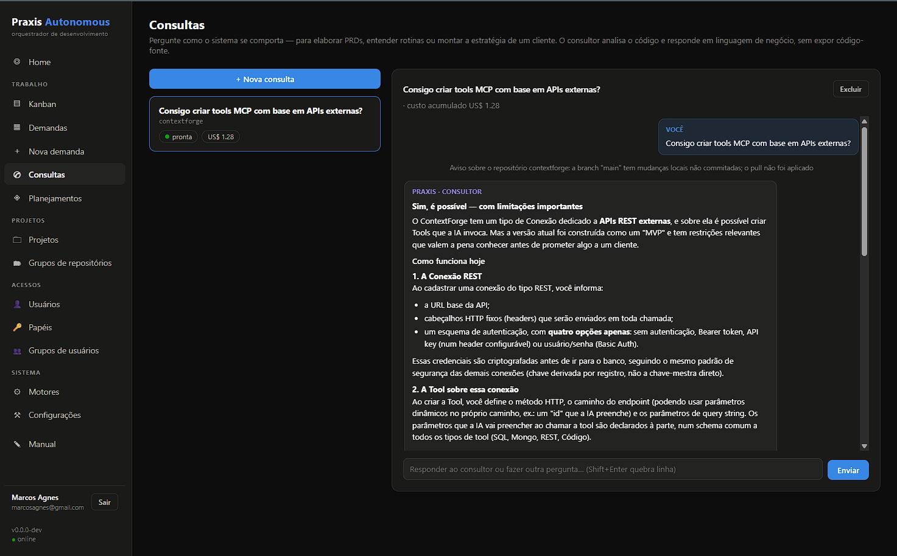
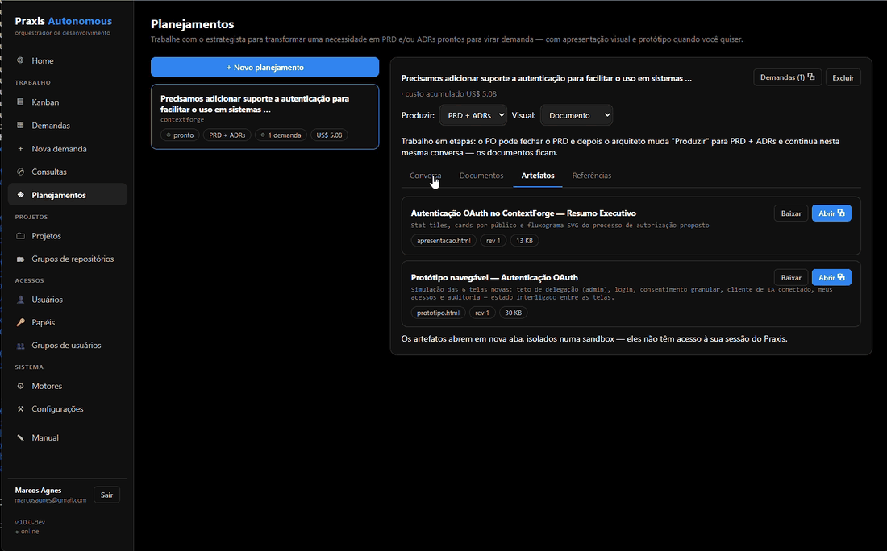
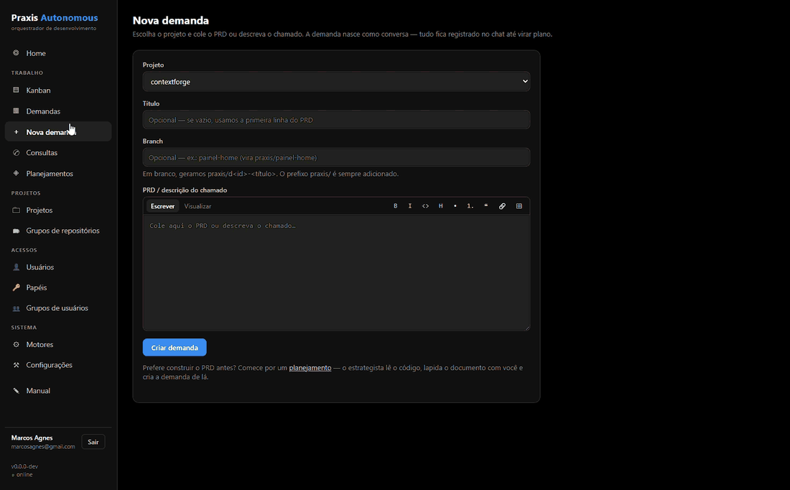

🇺🇸 **English** · 🇧🇷 [Português (Brasil)](README.pt-BR.md)

# Praxis Autonomous

**Your system's knowledge and business rules — served to the whole team, without
handing out the source code.**

Praxis sits on top of your git repositories and answers what support, product,
implementation, and partner teams need to know — in business language, with the
source code never exposed and no repo access to hand out. And when understanding
turns into work, it carries the demand end to end: AI-refined PRD, phased plan,
autonomous execution, merge request.

*Pure Go · single binary · embedded SQLite · 100% web UI*

*Available in English, Português, Español and 简体中文.*

---

## The problem — answers locked in the code, access handed out without need

The people who most need to understand the code are rarely the ones who wrote it:

- **Support** needs to know what happens when an invoice is past due to answer a
  customer — and files a ticket with the squad.
- **Implementation teams** need the setup strategy for a new customer — and depend
  on a developer's schedule.
- **Product** needs to know how billing works *today* before writing the PRD — and
  ends up writing it blind.
- **A developer from another squad** needs the business rules to build an
  integration, create a mock, or prototype a scenario — and has to read a codebase
  they have never seen.

Companies solve this the worst possible way: interrupting the developers who own
the code — or granting source-code access to anyone who might ever need an answer,
until half the company can clone the repositories. The knowledge stays tribal, and
least privilege goes out the window.

Praxis removes both problems at once: it **actually reads the code**, in read-only
mode, and returns answers, documents, prototypes — and even development ready to
merge — while the source code stays exactly where it belongs.

---

## Consultas (Queries) — business-rule answers, without exposing source code



Ask how the system behaves — *"what happens when an invoice is past due?"*, *"can
I create tools backed by external APIs?"* — and the consultant answers by reading
the code, in business language, **never showing source code** (a server-side
post-filter guarantees it). Your codebase becomes a self-service knowledge base
for the teams around it: support answers customers with confidence, product writes
PRDs grounded in real behavior, integrators map the business rules of a legacy
system before writing a line of code.

> **Real-world case — an L2/L3 support tier:** wire the Praxis API into your
> helpdesk and the ticket the L1 analyst can't solve with the obvious becomes a
> query — Praxis digs into the code and resolves around 90% of those cases,
> leaving the senior teams focused on the genuinely complex problems.

Access is its own permission (`consultas.usar`): you can create a "Support" or
"Product" role with no access to demands, code, or settings.

---

## Planejamentos (Plannings) — from a need to a PRD, with a navigable prototype



Describe a need and the **strategist** — reading the repositories — refines a
**PRD** and/or **ADRs** with you in an iterative conversation. Beyond the
documents, it generates a **visual presentation** (infographics, flowcharts) and,
on request, a **navigable prototype** of the proposed screens — all self-contained,
ready to present or attach to an email.

The PO closes the business vision, the architect continues **in the same
planning** with the technical decisions, and once the set is ready the PRD
**becomes a demand in one click**.

---

## Demandas (Demands) — autonomous development, end to end



Paste a PRD or a ticket description. The **analyst** reads the code and asks
objective questions (with ready-made suggestions — answering is one click), the
**planner** builds a phased plan and, once you approve it, the demand **runs on
its own** in the background: isolated worktree, dedicated branch, an executor →
gates → fixer → reviewer cycle, one commit per phase, and the branch published
for a Merge Request. You follow along on the Kanban, live log, diff, and
per-phase cost — and can pause, resume, or cancel at any time.

> The three (and only) moments that require a human: **answering the questions**,
> **approving the plan**, and **opening the MR / merging**.

---

## Why Praxis

- **Multi-project, multi-engine** — orchestrates `claude`, `codex`, or `opencode`,
  with per-task models and a per-demand budget.
- **Frontier AI at subscription cost** — the engines are AI harnesses running on
  the plans you already subscribe to: a fixed monthly cost instead of a per-token
  API bill. And if one plan's quota runs out, Praxis switches to the next engine
  automatically — the user never goes unanswered.
- **Nothing to install for users** — everything runs in the browser, including a
  **web VS Code** for manual adjustments in a demand's worktree.
- **Your code is protected** — execution in isolated worktrees, pushes limited to
  `praxis/*` branches, main is never touched; queries answer without repo access —
  least privilege by default.
- **Visible costs** — spend per demand, per project, and per month right on the
  Home screen.
- **Fits your workflow** — REST API with tokens and roles: open demands or run
  queries straight from your helpdesk, plus notifications via Telegram, Discord,
  Slack, and Google Chat.
- **Simple to operate** — a single Go binary with embedded SQLite: no Docker, no
  external database, no runtime dependencies.
- **Speaks your team's language** — the interface, the built-in manual, and the
  AI's own answers come in English, Portuguese, Spanish, or Chinese, chosen per
  user: the same query answered in Portuguese for support in Brazil and in
  Chinese for the team in Shenzhen.

---

## Getting started

Requirements: **Go 1.26+**, **git** on the PATH, and an authenticated AI harness
(`claude`, `codex`, or `opencode`).

**Linux/macOS**

```sh
go build -o praxis ./cmd/praxis
./praxis serve
```

**Windows**

```powershell
go build -o praxis.exe .\cmd\praxis
.\praxis.exe serve
```

Open **http://127.0.0.1:7799**, register a project (the folder of a git
repository), and create your first query or demand. The **Manual** menu, inside
the web UI, walks through the whole flow.

To reach the server from other machines without a certificate of your own, start
with `-tls` — Praxis generates a self-signed HTTPS certificate:

```sh
./praxis serve -addr 0.0.0.0:7799 -tls
```

Learn more in the [full guide](README_COMPLETO.md#network-access-https):
custom certificates, installing the certificate on devices, and good practices.

---

## Full documentation

The detailed guide lives in **[README_COMPLETO.md](README_COMPLETO.md)**: network
access with TLS, running as a service (systemd / Windows), REST API, notifications,
configuration parameters, security, and troubleshooting.
